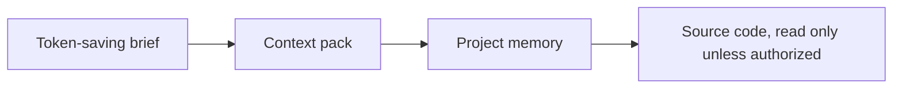

# Architecture

This example has no code architecture. A real note should identify verified components, entry points, data flow, dependencies, boundaries, and links to supporting source files.

```mermaid
flowchart LR
  B["Token-saving brief"] --> C["Context pack"]
  C --> P["Project memory"]
  P --> S["Source code, read only unless authorized"]
```
