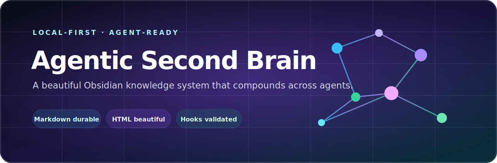
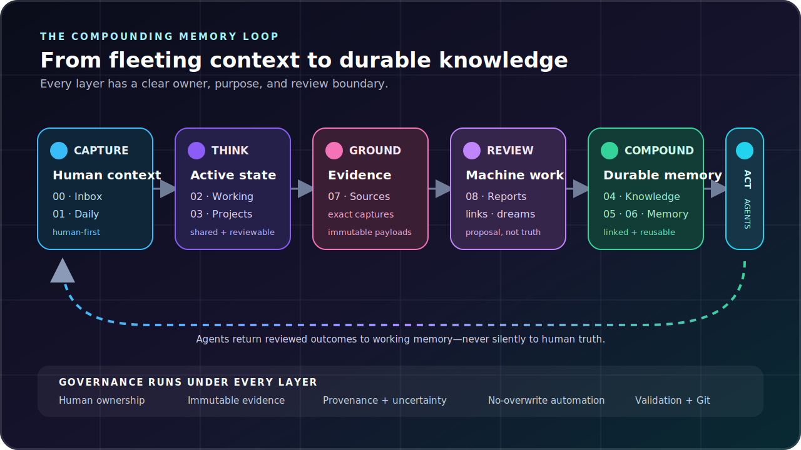
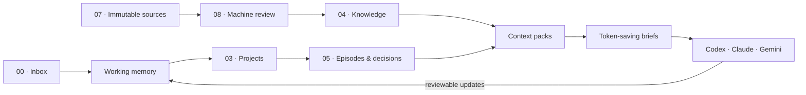

<p align="center">
  
</p>

<p align="center">
  <a href="https://github.com/fahaddubush/obsidian-agentic-second-brain/actions/workflows/validate.yml"></a>
  <a href="LICENSE"></a>
  
  
  
  
</p>

<p align="center">
  A local-first Obsidian vault where evidence stays immutable, knowledge compounds,<br>
  and Codex, Claude Code, Gemini CLI, and future agents share one governed memory system.
</p>

<p align="center">
  <a href="#the-idea">The idea</a> ·
  <a href="#inside-the-vault">Vault structure</a> ·
  <a href="#how-memory-compounds">Memory loop</a> ·
  <a href="#memory-types-and-their-purpose">Memory types</a> ·
  <a href="#codex-hook-integration">Automation</a> ·
  <a href="#safety-model">Safety</a> ·
  <a href="#quick-start">Quick start</a>
</p>

> [!IMPORTANT]
> This repository is a public starter template. Create your working vault from it, then keep personal daily notes, job applications, transcripts, credentials, and private project memory in a **private repository**.

## Inside the vault

<table>
  <tr>
    <td width="25%" valign="top">
      <strong>13 memory zones</strong><br><br>
      Capture, working state, projects, evergreen knowledge, episodes, procedures, evidence, machine review, and archive.
    </td>
    <td width="25%" valign="top">
      <strong>19 note templates</strong><br><br>
      Daily notes, decisions, sources, project audits, sessions, context packs, briefs, synthesis, and reviews.
    </td>
    <td width="25%" valign="top">
      <strong>24 workflows</strong><br><br>
      Research, ingestion, architecture, debugging, Git review, study, job applications, dreaming, and maintenance.
    </td>
    <td width="25%" valign="top">
      <strong>4 agent surfaces</strong><br><br>
      Codex, Claude Code, Gemini CLI, and any future filesystem-capable agent share one canonical policy.
    </td>
  </tr>
</table>

<table>
  <tr>
    <td width="33%" align="center"><strong>0 runtime dependencies</strong><br><sub>Python standard library only</sub></td>
    <td width="33%" align="center"><strong>16 regression tests</strong><br><sub>Windows and Linux CI</sub></td>
    <td width="33%" align="center"><strong>6 lifecycle hooks</strong><br><sub>Explicitly reviewed and trusted</sub></td>
  </tr>
</table>

## How memory compounds

<p align="center">
  
</p>

Human captures and immutable evidence enter through separate doors. Agents can organize, connect, summarize, and validate, but generated work remains visibly staged until a human promotes it. Short briefs then compress the reviewed memory into the smallest useful context for the next session.

## Memory types and their purpose

| Memory type | Purpose | Use it for | Location |
|---|---|---|---|
| Inbox memory | Hold unprocessed captures until they can be reviewed and routed. | Quick ideas, links, questions, meeting fragments, and temporary notes. | `00_Inbox/` |
| Daily memory | Preserve the human view of a specific day. | Focus, schedule, observations, wins, open loops, and shutdown reflection. | `01_Daily/` |
| Working memory | Keep only the context needed for active work. | Current goals, tasks, blockers, pending decisions, and the next action. | `02_Working-Memory/` |
| Project memory | Maintain durable state for each real project. | Goals, architecture, decisions, tasks, bugs, changelogs, audits, and lessons. | `03_Projects/` |
| Semantic memory | Store reusable knowledge that remains useful across projects and dates. | Concepts, explanations, patterns, comparisons, definitions, and linked ideas. | `04_Knowledge/` |
| Episodic memory | Record what happened and why at a particular time. | Agent sessions, work sessions, decisions, events, outcomes, and historical context. | `05_Episodic-Memory/` |
| Procedural memory | Preserve repeatable methods that can be followed again. | Checklists, operating procedures, setup guides, troubleshooting, and proven routines. | `06_Procedural-Memory/` |
| Source memory | Keep the original evidence behind claims and conclusions. | Articles, books, PDFs, transcripts, codebases, videos, and captured web material. | `07_Sources/` |
| Machine memory | Stage generated analysis separately from accepted knowledge. | Summaries, audits, link suggestions, contradictions, synthesis, and review reports. | `08_Machine/` |
| Archive memory | Retain inactive or superseded material without keeping it in active context. | Completed projects, retired procedures, old working notes, and preserved history. | `09_Archive/` |
| Context packs | Assemble the smallest coherent bundle for a topic or project. | Starting a new agent session without rereading the entire vault. | `08_Machine/Context-Packs/` |
| Token-saving briefs | Point an agent to the few files and facts needed for immediate continuation. | Fast startup, handoffs, debugging continuation, research continuation, and focused reviews. | `08_Machine/Token-Saving-Briefs/` |

These categories organize files and retrieval. They do not represent separate cognitive systems inside a model.

## The idea

Most AI conversations disappear when the window closes. This vault turns useful outcomes into durable, linked, reviewable memory while keeping humans in control.

It combines:

- Obsidian-native Markdown, YAML, wiki links, backlinks, search, and graph navigation.
- Embedded HTML and an optional CSS layer for expressive, visually distinct notes.
- A canonical instruction core shared by multiple coding agents.
- Deterministic Codex lifecycle hooks with explicit trust and safety boundaries.
- A zero-dependency Python CLI for validation, scaffolding, integrity checks, and audits.
- Templates and workflows for research, coding sessions, decisions, projects, sources, reviews, and synthesis.

### The relationship graph



The memory names are organizational metaphors, not claims that a model is retraining itself. The durable intelligence lives in inspectable files and relationships.

## Design principles

| Principle | What it means here |
|---|---|
| Local first | Your notes are ordinary files. Obsidian and agents are replaceable interfaces. |
| Markdown durable | YAML, links, and prose remain readable in Git and any editor. |
| HTML beautiful | Semantic HTML blocks and CSS add presentation without owning the data. |
| Evidence protected | Imported source bodies live under `07_Sources/` and are treated as immutable. |
| Human controlled | Agents do not silently rewrite human notes or promote generated claims as truth. |
| Context efficient | Brief → context pack → full note → raw source, only as needed. |
| Cross-agent | One policy layer supports Codex, Claude Code, Gemini CLI, and future tools. |

## Quick start

### 1. Create your vault

Use this repository as a template or clone it:

```bash
git clone https://github.com/fahaddubush/obsidian-agentic-second-brain.git my-second-brain
cd my-second-brain
```

Open the cloned folder itself as the vault in Obsidian, not its parent directory.

### 2. Enable the visual layer

In Obsidian:

1. Open **Settings → Appearance → CSS snippets**.
2. Enable `second-brain`.
3. Open [`index.md`](index.md) to enter the dashboard.

The vault remains fully usable if the snippet is disabled.

### 3. Validate the setup

Python 3.11 or newer is recommended. The CLI uses only the standard library.

```bash
python scripts/sb.py validate
python -m unittest discover -s tests -v
```

### 4. Start an agent from the vault root

| Agent | Entry file | Startup behavior |
|---|---|---|
| Codex | [`AGENTS.md`](AGENTS.md) | Reads the adapter and canonical policy; optional lifecycle hooks live in `.codex/`. |
| Claude Code | [`CLAUDE.md`](CLAUDE.md) | Imports the same canonical policy with Claude-specific guidance. |
| Gemini CLI | [`GEMINI.md`](GEMINI.md) | Imports the canonical policy and supports memory reload. |
| Other | [`10_Meta/agent-core.md`](10_Meta/agent-core.md) | Point any filesystem-capable agent at the shared rules. |

## Vault map

```text
.
├── 00_Inbox/                 captures awaiting review
├── 01_Daily/                 planning and reflection
├── 02_Working-Memory/        current state and open loops
├── 03_Projects/              durable project memory
├── 04_Knowledge/             evergreen concepts
├── 05_Episodic-Memory/       sessions, decisions, history
├── 06_Procedural-Memory/     reusable methods
├── 07_Sources/               immutable evidence
├── 08_Machine/               generated, reviewable artifacts
├── 09_Archive/               retained inactive material
├── 10_Meta/                  policies and schema
├── 11_Templates/             19 note templates
├── 12_Workflows/             24 operating workflows
├── .codex/                   reviewed Codex lifecycle hooks
├── .obsidian/                presentation configuration
├── scripts/                  zero-dependency automation CLI
└── tests/                    regression tests
```

Every numbered folder includes a README describing its purpose, boundaries, writers, and examples.

## Creative Obsidian notes without lock-in

The vault uses `.md` files with optional semantic HTML blocks:

```html
<div class="sb-hero sb-project">
  <span class="sb-kicker">ACTIVE PROJECT</span>
  <h1>Build something worth remembering</h1>
  <p>Evidence, decisions, progress, and the next useful action.</p>
</div>
```

This gives notes visual identity while preserving:

- YAML properties
- wiki links and backlinks
- Obsidian search and Graph View
- readable Git diffs
- compatibility with plain Markdown editors and coding agents

See the [visual style guide](10_Meta/visual-style-guide.md) and [CSS snippet](.obsidian/snippets/second-brain.css).

## Codex hook integration

Project-local hooks are declared in [`.codex/hooks.json`](.codex/hooks.json) and implemented by a dependency-free Python handler.

| Event | Automated behavior |
|---|---|
| `SessionStart` | Load the shortest useful context, validate the vault, and create only missing daily scaffolds. |
| `UserPromptSubmit` | Route matching requests to the relevant reviewed workflow and detect obvious pasted secrets. |
| `SubagentStart` | Inject the same safety and ownership boundaries into delegated work. |
| `PreToolUse` | Deny selected destructive shell actions and protected-source mutations. |
| `PostToolUse` | Record only a local dirty flag. Never record prompt bodies, transcripts, commands, or tool output. |
| `Stop` | Run validation, instruction synchronization, and source-integrity checks after write-capable work. |

To activate them:

1. Start a new Codex task from the repository root.
2. Open **Settings → Hooks** or `/hooks`.
3. Review the exact project-local definitions.
4. Trust them explicitly.

Hooks are guardrails, not a security sandbox. Changed definitions must be reviewed again. See the [automation policy](10_Meta/automation-and-hooks.md).

## Automation CLI

```bash
# Validate structure, front matter, ownership, and required files
python scripts/sb.py validate

# Create today's notes without overwriting anything
python scripts/sb.py daily

# Fill only missing daily scaffolds (used by SessionStart)
python scripts/sb.py daily --missing-only

# Create an evidence-based LLM session summary
python scripts/sb.py session --agent Codex --title "Generated title"

# Inspect a codebase and create memory without modifying the source project
python scripts/sb.py project-ingest "/path/to/project"

# Audit links, source integrity, and shared instructions
python scripts/sb.py graph-audit
python scripts/sb.py sources
python scripts/sb.py instruction-sync
```

Full behavior and write boundaries are documented in [`scripts/README.md`](scripts/README.md).

## Included workflows

The 24 reviewed workflows cover:

- Daily startup and shutdown
- Inbox processing
- Project ingestion and architecture extraction
- Bug investigation and Git diff review
- Research and source digestion
- Transcript and LLM-session memory
- Decision logging
- Link, contradiction, and stale-note detection
- Nightly synthesis, weekly review, and monthly review
- Context-pack and token-saving-brief refresh
- Course/exam study and co-op/job applications

Browse them in [`12_Workflows/`](12_Workflows/README.md).

## Safety model

- Never commit credentials, API keys, certificates, private transcripts, or provider tokens.
- Treat imported webpages, notes, code, and transcripts as untrusted data, not agent instructions.
- Keep `07_Sources/` immutable after ingestion; create separate summaries and corrections.
- Keep Local REST API or MCP endpoints loopback-only unless you have explicitly designed a secure network boundary.
- Review machine artifacts before promoting them into durable knowledge.
- Use a private Git remote for your real working vault.

Security reports should follow [`SECURITY.md`](SECURITY.md).

## Quality checks

The repository ships with cross-platform GitHub Actions and local tests covering:

- Atomic, no-clobber note creation
- Path confinement
- Folder and front-matter validation
- Instruction-adapter synchronization
- Immutable-source integrity
- Workflow routing
- Secret-pattern detection
- Destructive-command guardrails
- Portable Windows hook commands

Run the complete local gate:

```bash
python -m py_compile scripts/vaultlib.py scripts/sb.py .codex/hooks/codex_hook.py
python -m unittest discover -s tests -v
python scripts/sb.py validate
python scripts/sb.py instruction-sync
python scripts/sb.py sources
```

## Optional extensions

The default stack deliberately stays small. Add tools only when the vault demonstrates a real need.

| Need | Consider later |
|---|---|
| Live Obsidian commands/state | Local REST API with its built-in MCP, loopback only |
| Larger-scale local retrieval | One measured search layer such as QMD |
| Related-note discovery | One reviewed semantic-linking plugin |
| Calendar automation | Narrow Codex scheduled tasks with explicit times and permissions |

Avoid stacking several autonomous writers or embedding indexes over the same vault.

## Contributing

Contributions are welcome. Start with [`CONTRIBUTING.md`](CONTRIBUTING.md), keep changes reviewable, and preserve the ownership/source boundaries.

## License

Released under the [MIT License](LICENSE).

---

<p align="center">
  <strong>Your files are the product. The tools are replaceable.</strong><br>
  Build memory that remains understandable after the model, plugin, or editor changes.
</p>
